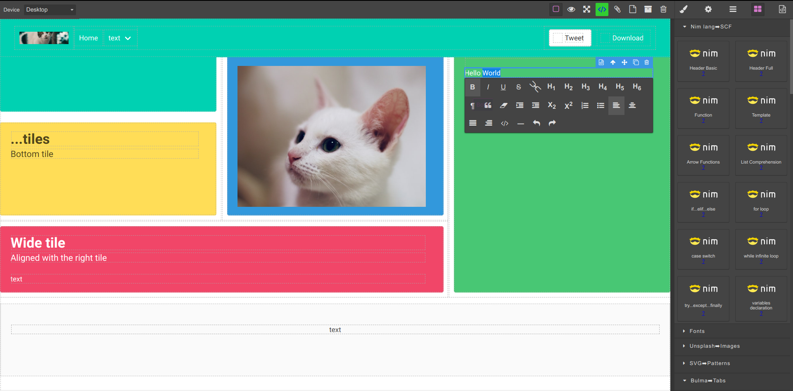
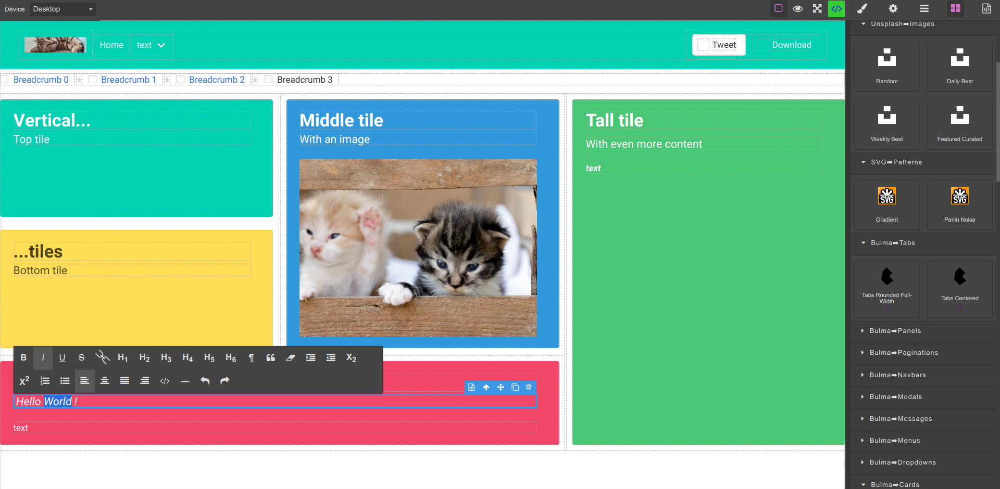

# GrapeSpectre

- [Grapes JS](https://grapesjs.com) + [Spectre CSS](https://picturepan2.github.io/spectre/getting-started.html) =
  HTML/CSS [WYSIWYG](https://en.wikipedia.org/wiki/WYSIWYG) without JavaScript, designed for
  [Nim](http://nim-lang.org) [Source Code Filters](https://nim-lang.github.io/Nim/filters.html) starter templates and
  [Nim to JavaScript/WASM target](https://nim-lang.github.io/Nim/backends.html#backends-the-javascript-target).

